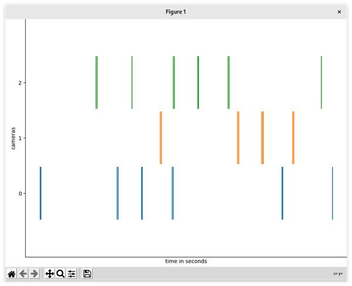
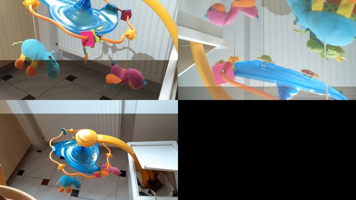

# Sub-millisecond Accurate Multiple Video Synchronization Using Camera Flashes

A python module for multiple video synchronization using photographic camera flashes. The module synchronizes arbitrary number of video sequences when there are present abrupt lighting changes that affect majority of pixels (e.g. flashes). The video sequences do not need to be overlapping. 

Sequences acquired using rolling shutter image sensors (vast majority of CMOS image sensors) can be synchronized up to sub-millisecond accuracy.

Outputs:

- sub-frame synchronized time for a frame, row pair (for rolling shutter)
- synchronized video sequences (frames with minimal temporal distances from all input sequences)

For details, sample synchronized videos and published paper see [project page](http://cmp.felk.cvut.cz/~smidm/rolling-shutter-camera-synchronization-with-sub-millisecond-accuracy.html).

## Installation

```
pip install git+https://github.com/smidm/flashvideosynchronization.git
```

## CLI

Command line tool for video synchronization. Features: 

- show detected flashes
- write a preview video montage of synchronized videos
- write synchronized videos 

```
usage: synchronizevideo [-h] [--write-preview WRITE_PREVIEW]
                        [--out-synchronized-dir OUT_SYNCHRONIZED_DIR]
                        [--show-flashes]
                        [--save-synchronization-meta-dir SAVE_SYNCHRONIZATION_META_DIR]
                        files [files ...]

Convert and visualize mot ground truth and results.

positional arguments:
  files                 input video files

optional arguments:
  -h, --help            show this help message and exit
  --write-preview WRITE_PREVIEW
                        write synchronized preview montage
  --out-synchronized-dir OUT_SYNCHRONIZED_DIR
                        write input files synchronized to a directory
  --show-flashes        show a chart with detected flashes
  --save-synchronization-meta-dir SAVE_SYNCHRONIZATION_META_DIR
                        save FlashVideoSynchronization and
                        SynchronizedSource(s) to a directory

```

Examples:

```
$ synchronizevideo --show-flashes sample_data/*

[Memory]0.0s, 0.0min    : Loading detect_events_in_video...
[Memory]0.0s, 0.0min    : Loading detect_events_in_video...
[Memory]0.0s, 0.0min    : Loading detect_events_in_video...
```



```
$ synchronizevideo --write-preview montage.mp4 sample_data/*

[Memory]0.0s, 0.0min    : Loading detect_events_in_video...
[Memory]0.0s, 0.0min    : Loading detect_events_in_video...
[Memory]0.0s, 0.0min    : Loading detect_events_in_video...
  0%|                                                                                                                                             | 0/576 [00:00<?, ?it/s]/home/matej/Private/Dropbox/prace/github/imagesource/imagesource/video.py:115: UserWarning: using slow but frame accurate seeking (reading frame by frame)
  warn('using slow but frame accurate seeking (reading frame by frame)')
100%|███████████████████████████████████████████████████████████████████████████████████████████████████████████████████████████████████| 576/576 [00:15<00:00, 36.92it/s]
```



## Download Sample Data

```
curl -LO http://cmp.felk.cvut.cz/~smidm/download/sample_data.zip
unzip sample_data.zip
rm sample_data.zip
```

## API

```python
import matplotlib.pylab as plt
import imagesource
from flashvideosynchronization import FlashVideoSynchronization

# example 3 camera synchronization
cameras = [1, 2, 3]
filenames = {cam: 'sample_data/%d.mp4' % cam for cam in cameras}

# load video files and extract frame timestamps
sources = {cam: imagesource.TimedVideoSource(filenames[cam])
           for cam in cameras}
for source in sources.values():
    source.extract_timestamps()

sync = FlashVideoSynchronization()
sync.detect_flash_events(filenames)

# manually set rough offset by matching an event
sync.show_events()
matching_events = {1: 0, 2: 0, 3: 0}
offsets = {cam: sync.events[cam][matching_events[cam]]['frame_time'] for cam in cameras}
sync.show_events(offsets)  # now the events should appear aligned

# synchronize cameras: find parameters transformations that map camera time to reference camera time
sync.synchronize(cameras, offsets, base_cam=1)

# get sub-frame sychronized time for camera 1, frame 10 and row 100
print(sync.get_time(cam=1, frame_time=sources[1].timestamps_ms[10], row=100))

# get frame synchronized image sources
sources_sync = sync.get_synchronized_image_sources(sources, master=1, dropped=False)

# show synchronized frames
frame = 10
for cam in cameras:
    plt.figure()
    plt.imshow(sources_sync[cam].get_image(frame))

plt.show()
```

For more see [sample.py](sample.py).

The computationally demanding functions `FlashVideoSynchronization.detect_flash_events()` and `extract_features()` are cached using [joblib](https://pythonhosted.org/joblib/). Until the inputs change, they are computed only once. The cache is stored in `./joblib` directory.

For more examples see: https://github.com/smidm/flashvideosynchronization-notebook.

## Your Video Sequences

I would like to evaluate the software on more multi-view video sequences with abrupt lighting changes. If you can provide your data, please contact me at http://cmp.felk.cvut.cz/~smidm/.

## Cite

M. Šmíd and J. Matas, “Rolling Shutter Camera Synchronization with Sub-millisecond Accuracy,” in VISAPP - 12th International Conference on Computer Vision Theory and Applications, 2017.

